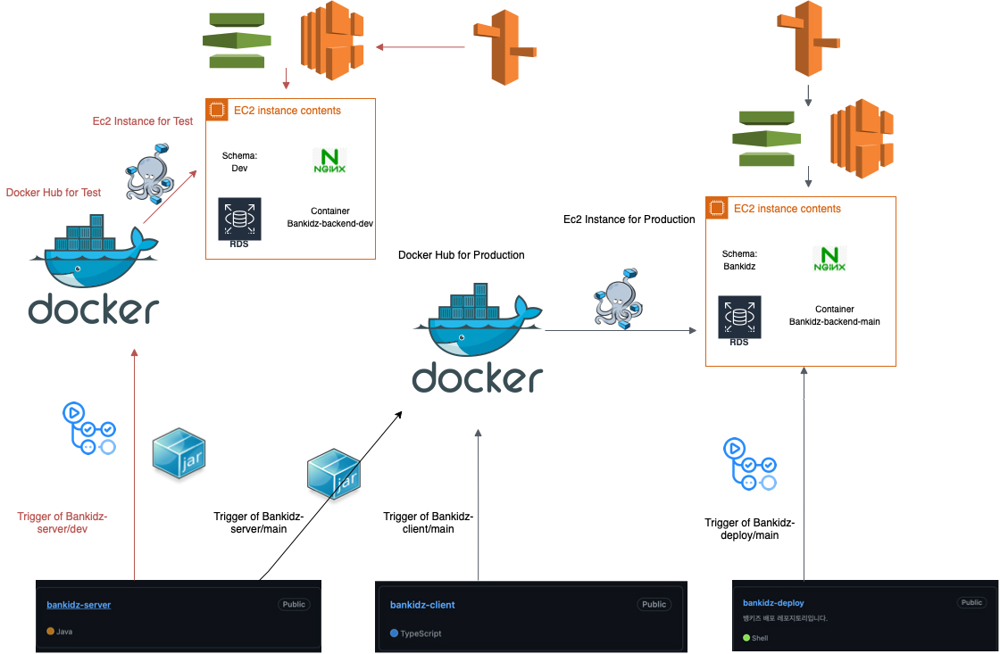

# 1. 어린이를 위한 핀테크 서비스, 뱅키즈


|    AD    | Instagram |               PC Web                |                           iOS App                            |                         Android App                          |
| :------: | :-------: | :---------------------------------: | :----------------------------------------------------------: | :----------------------------------------------------------: |
| (준비중) | (준비중)  | [bankidz.com](https://bankidz.com/) | <a href="https://play.google.com/store/apps/details?id="></a> | <a href='https://play.google.com/store/apps/details?id='></a> |

* 뱅키즈는 웹뷰 환경에 최적화 되어 있습니다. 기타 웹 브라우저 환경에서는 일부 기능이 작동하지 않습니다.
* 뱅키즈 앱은 현재 App Store, Google Play 출시를 위해 심사중입니다.

<br/>

# 2. 뱅키즈를 만드는 사람

| <br />[신성우](https://github.com/24siefil) | <br />[한규진](https://github.com/9yujin) | <br />[이근우](https://github.com/rms5213) | <br />[김민준](https://github.com/sanbonai06) | <br />[주어진사랑](https://github.com/ozzing) |
| :----------------------------------------------------------: | :----------------------------------------------------------: | :----------------------------------------------------------: | :----------------------------------------------------------: | :----------------------------------------------------------: |
|                   Web-client<br />Engineer                   |                   Web-client<br />Engineer                   |                   App-client<br />Engineer                   |                     Server<br />Engineer                     |                     Server<br />Engineer                     |
|               [안도영](mailto:ado20@naver.com)               |           [박소정](mailto:the1sojeong@ewhain.net)            |             [김수빈](mailto:beeny9958@gmail.com)             |            [최지혜](mailto:sbbhfl6135@gmail.com)             |                                                              |
|                             CEO                              |                              PO                              |                           Designer                           |                           Designer                           |                                                              |

<br/>

# 3. 뱅키즈를 만드는 기술

뱅키즈는 가설 검증 주기를 최소화 하기 위해 푸시알림, 딥링크를 통한 가족 초대 기능을 제외한 모든 비즈니스 로직을 웹 기술로 구현합니다. 이를 통해 사용자에게 항상 최신의 서비스를 제공하고 피드백에 기민하게 대응합니다.

- **코어**: React, TypeScript

- **상태관리**: Redux, ReactQuery

- **디자인 시스템**: [storybook]([bankidz.github.io/bankidz-client](https://bankidz.github.io/bankidz-client)), [Figma](https://www.figma.com/file/pF7iygMk2IXYGZxXockGY8/%5B1.0-ver%5D-%EB%94%94%EC%9E%90%EC%9D%B8?node-id=2%3A3), Theme-provider

- **스타일링**: Styled-components

- **코드품질**: ESLint, Prettier

- **CI/CD**: Github-actions, Docker-compose

- **버전관리**: Git with Github, Git-flow

- **웹뷰 앱**: React Native with EXPO

- **협업**: Slack, Notion, Figma, Github

<details>
<summary>디랙토리 구조</summary>
<div markdown="1">

  ```
  .
  ├── App.tsx
  ├── assets
  ├── components # business logic, UI
  ├── index.tsx
  ├── lib
  │   ├── apis # api call, server-side type
  │   ├── constants # macro
  │   ├── hooks # custom hook, query
  │   ├── styles # Theme-provider
  │   ├── types # client-side type
  │   └── utils # reusable function
  ├── pages # router
  └── store
      ├── app # Redux store
      └── slices # RTK slice
  ```
</div>
</details>

<details>
<summary>Architecture</summary>
<div markdown="1">

  

뱅키즈의 개발 환경은 테스트 환경(dev)과 실 서비스 환경(main)이 분리되어 있습니다. 각 환경(branch)은 Github-actions, Dock-compose 기반 CI/CD 및 AWS EC2 인스턴스 기반 서버가 구축되어 있습니다. 또한, push 및 태깅 이벤트 감지를 통해 Docker-compose로 이미지 push가 trigger 됩니다. 실 서비스 환경의 이미지는 Github의 Relase 버저닝을 통해 관리됩니다.

</div>
</details>

<br/>

# 4. 주요 기능

## 4.1. 회원관리, 온보딩 (공통)

1. 애플 소셜 로그인 → 로그아웃 → 카카오 소셜 로그인 → 회원 탈퇴
2. 생년월일 → 프로필 → 푸시알림 동의 → 튜토리얼 → 홈

<details>
<summary>자세히</summary>
<div markdown="1">

  - 카카오, 애플 소셜 로그인을 사용합니다.
  - 서버로부터 받은 accessToken은 memory (Redux Store)를 통해 관리되며, refreshToken은 httpOnly & secure cookie를 통해 관리되어 Client에서의 직접 접근을 차단하고 보안성을 제고합니다. (해당 체계는 웹뷰 이식 과정에서 EXPO SDK 관련 cookie 호환성 문제로, token이 localStorage를 통해 관리되는 것으로 수정되었습니다.)


</div>
</details>

|  |  |
| ------------------------------------------------------------ | ------------------------------------------------------------ |

<br/>

## 4.2. 홈 탭 (자녀)

1. 걷고있는 돈길 → 돈길 포기하기 → 실패한 돈길 삭제
2. 대기중인 돈길 → 거절된 돈길 삭제
3. 알림내역

<details>
<summary>자세히</summary>
<div markdown="1">

  - 홈 탭에서는 서로간 종속성을 갖는 네가지 종류의 돈길에 대한 CRUD가 가능합니다.
  - 홈 탭의 데이터는 ReactQuery 기반의 interval refetching을 통해 최신상태를 유지합니다.
  - 알림내역은 무한스크롤 기반으로 데이터를 지속적으로 fetch 합니다.

</div>
</details>

|  |  |  |
| ------------------------------------------------------------ | ------------------------------------------------------------ | ------------------------------------------------------------ |

<br/>

## 4.3. 돈길 계약하기, 돈길 걷기 탭 (자녀)

1. 계약 대상 → 계약 상품 → 이름, 목표금액 → 이자율, 매주 저금액 → 서명 → 계약서 확인
2. 돈길 걷기

<details>
<summary>자세히</summary>
<div markdown="1">

  …

</div>
</details>

|  |  |
| ------------------------------------------------------------ | ------------------------------------------------------------ |

<br/>

## 4.4. 홈 탭, 이자 내역 탭 (부모)

1. 각 자녀의 제안받은 돈길, 금주의 돈길
2. 제안받은 돈길 → 수락하기 → 거절하기
3. 지급이 필요한 이자 → 자세히 보기 → 지급 완료하기

<details>
<summary>자세히</summary>
<div markdown="1">

  - 선택된 자녀의 데이터만 optimistic하게 fetch 하여 효율적으로 리소스를 사용합니다.
  - fetch된 데이터는 cache 되어 추후 로딩을 최적화 합니다.

</div>
</details>

|  |  |  |
| ------------------------------------------------------------ | ------------------------------------------------------------ | ------------------------------------------------------------ |

<br/>

## 4.5. 마이페이지 탭 및 가족 초대 (공통)

1. 딥링크를 통한 가족 초대
2. 알림 설정 localStorage Caching
3. 설정

<details>
<summary>자세히</summary>
<div markdown="1">

  …

</div>
</details>


|  |  |  |
| ------------------------------------------------------------ | ------------------------------------------------------------ | ------------------------------------------------------------ |

<br/>

## 4.6. 기타

1. React-transition-group 기반 Routing Animation
2. Skeleton UI, ReactQuery 기반 Caching
3. 우선순위에 따른 전역 API 에러처리

|  |  |  |
| ------------------------------------------------------------ | ------------------------------------------------------------ | ------------------------------------------------------------ |

<br/>

# 5. 역할 분담

### 신성우

- [회원 관리 및 온보딩 (공통)](https://github.com/bankidz/bankidz-client#41-%ED%9A%8C%EC%9B%90%EA%B4%80%EB%A6%AC-%EC%98%A8%EB%B3%B4%EB%94%A9-%EA%B3%B5%ED%86%B5)
- [홈 탭 (자녀)](https://github.com/bankidz/bankidz-client#42-%ED%99%88-%ED%83%AD-%EC%9E%90%EB%85%80)
- [홈 탭, 이자 내역 탭 (부모)](https://github.com/bankidz/bankidz-client#44-%ED%99%88-%ED%83%AD-%EC%9D%B4%EC%9E%90-%EB%82%B4%EC%97%AD-%ED%83%AD-%EB%B6%80%EB%AA%A8)
- React, TypeScript, Redux, Theme-provider 기반 Boiler-plate 세팅
- Coding Convention 정립
- OAuth 전략, JWT 운용
- 우선순위에 따른 전역 API 에러처리
- 전역상태로 관리되는 모달
- Skeleton UI
- Google Analytics 연동

### 한규진

- [돈길 계약하기, 돈길 걷기 탭 (자녀)](https://github.com/bankidz/bankidz-client#42-%ED%99%88-%ED%83%AD-%EC%9E%90%EB%85%80)
- [마이페이지 탭 및 가족 초대 (공통)](https://github.com/bankidz/bankidz-client#45-%EB%A7%88%EC%9D%B4%ED%8E%98%EC%9D%B4%EC%A7%80-%ED%83%AD-%EB%B0%8F-%EA%B0%80%EC%A1%B1-%EC%B4%88%EB%8C%80-%EA%B3%B5%ED%86%B5)
- 알림 내역 (공통)
- Github-actions, Docker-compose 기반 CI/CD 구축
- storybook, Theme-provider 기반 디자인 시스템 세팅
- 전역상태로 관리되는 바텀시트
- React-transition-group 기반 Routing Animation
- Routing, Layout, Craco 기반 절대경로 세팅

<br/>

# 6. 개발 후기

- **신성우** | [우당탕 뱅키즈 개발기](https://24siefil.oopy.io/bankidz)
- **한규진** | [Antifreeze! 뱅키즈](https://9yujin.tistory.com/category/%F0%9F%90%AC%20%ED%94%84%EB%A1%9C%EC%A0%9D%ED%8A%B8/%EB%B1%85%ED%82%A4%EC%A6%88)

<br/>

# 7. 수상 실적

| 수상 일자 | 대회명                               | 최종 실적                                   | 상금 (만원) |
| :-------- | :----------------------------------- | :------------------------------------------ | :---------- |
| 22.07.14  | SC제일은행 ‘Women in Fintech’        | 최종선정, Creator상 수상 (2위)              | 500         |
| 22.08.05  | 신촌 연합 IT 창업 학회 CEOS 데모데이 | 우수상 수상                                 | 10          |
| 22.08.16  | 신한은행 ‘퓨쳐스랩 8기 뱅크플러스’   | 1차 서류 합격, 2차 면접 탈락                | -           |
| 22.08.19  | 오렌지 플래닛 ‘오렌지 가든’ 6기      | 1차 서류 합격, 2차 인터뷰 합격, 3차 PT 탈락 | -           |
| 22.08.28  | 전국 대학생 창업컨퍼런스 ‘시도’      | 결승진출                                    | -           |
| 22.08.31  | 예비창업패키지 프리스쿨              | 최종선정                                    | 460         |

<br/>

*Copyright ⓒ All rights reserved by 신성우, 한규진*
